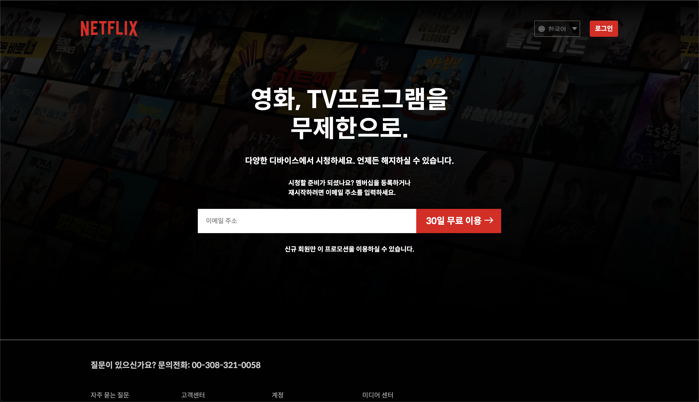
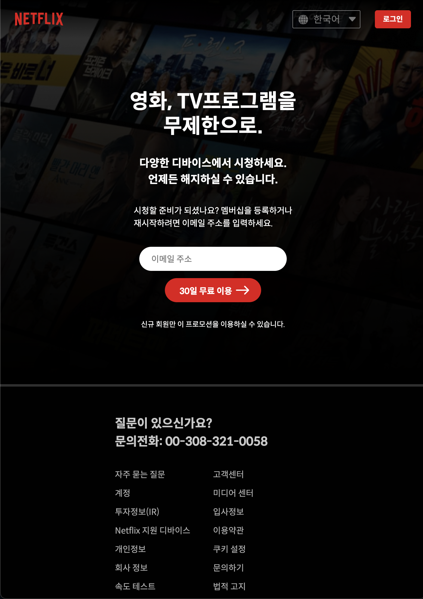

# 넷플릭스 과제

## 컴포넌트로 구성해서 제작

- 버튼, 헤더, 푸터, 이메일 폼, 랭귀지 셀렉트 박스로 구성

### 헤더

flex로 배치, 로그인 및 셀렉트 박스를 div로 묶어 레이아웃 구성

### 푸터

특이점은 박스가 가운데에 있으나 박스 내에서 내용은 왼쪽 정렬

- width값을 주고 flex column, justify-contents: center로 배치

링크 모음들은 일정한 간격을 두고 한 줄에 4개씩 배치

- grid를 사용할까 했으나, flex로도 가능할 것 같아서 시도 / 성공

### 이메일 폼

반응형에 맞춰 디자인 모양이 아예 달라지게 구성하는 것이 포인트

- JS로 해결해야하는 부분이나, 아직 폼 디자인을 자유롭게 하는 것이 어려움

ex `)` in-valid시 나오는 경고 문구, 아이콘, label의 자유로운 배치 등이 어려움

### 랭귀지 셀렉트 박스

markup을 select로 하였으나 셀렉트 박스의 디자인을 자유롭게 변경하는 것이 어렵다.

이로인해 많은 사람들이 직접 div로 커스텀을 한다고 함.

---

## 반응형 웹디자인

1. 데스크탑버전
   

2. 
